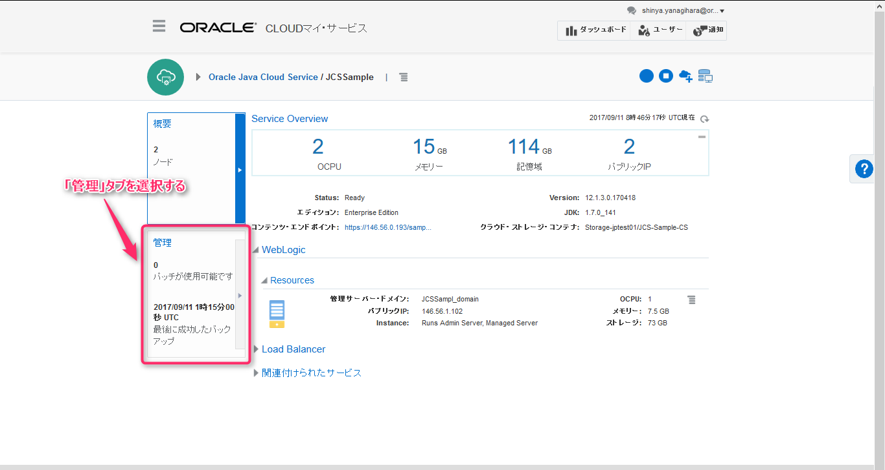

# Java Cloud Service のバックアップの作成とリストア

## 1. Java Cloud Service インスタンス概要画面の表示

Java Cloud Service サービス・コンソール画面からインスタンス概要画面を開きます。

標準では「概要」タブが選択されているので、その下の「管理」タブを選択します。

 

## 2. 手動バックアップの実施

画面中央に表示されている **「今すぐバックアップ」** をクリックし、バックアップ情報入力のダイアログボックスを開きます。

以下の選択肢を選択します。

|項目名|選択肢|
|-----|------|
|データベースを含める|いいえ|
|永久に保持|いいえ|

「永久に保持」を「いいえ」にすると、保存期間（デフォルト：30日）が過ぎると、バックアップを削除します。

バックアップを取得しています。暫く（１０分程度）待ちます。

 

## 3. リストア実施確認のための構成変更

バックアップ・データからリカバリを実施する際の確認のために構成情報に変更をいれます。

アプリケーションのデプロイメント手順確認の中でデプロイを行った **HR** アプリケーションを削除します。

「デプロイメント」を選択し、表示されるアプリケーション一覧の中から「HR」アプリケーションを選び、横にあるチェックボックスを選択済みとします。

そして、「停止」ボタンをクリックし、「ただちに強制停止」を選択します。

「はい」を選択します。

「ロックして編集」をクリックします。次に、「HR」を再度選択済みとして、「削除」ボタンをクリックします。

「はい」を選択します。

「変更のアクティブ化」をクリックします。

下記のURLでアプリケーションの動作確認を改めて実施します。

`https://<パブリック IP>/HR-ViewController-context-root/faces/hr.xhtml`

すると、404エラーが表示されてアプリケーションがなくなっている事が確認できます。

 

## 4. リストアの実施

手動で作成したバックアップ・データの右側にある
メニューをクリックし、「リストア」を選択します。

表示されるダイアログ・ボックスで「リストア」をクリックします。

リストア実施の確認で「はい」を選択します。

## 5. リストアの確認

下記のURLでアプリケーションの動作確認を改めて実施します。

`https://<パブリック IP>/HR-ViewController-context-root/faces/hr.xhtml`

すると、HRアプリケーションが復旧し稼働している事が確認できます。