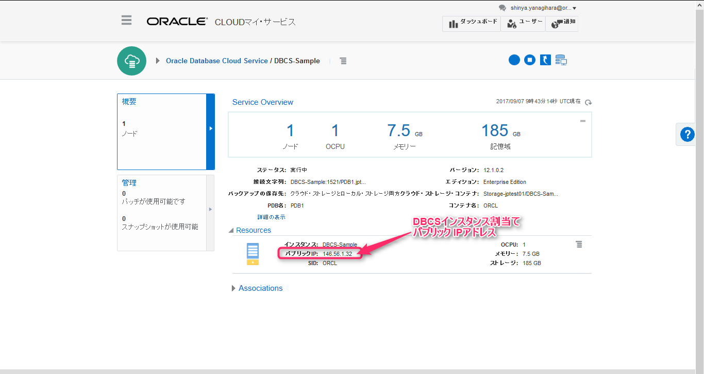

# データベース・スキーマ及びデータの作成

## 1. Database Cloud Service のパブリック・IPアドレスの確認



Database Cloud Service のインスタンス詳細画面にアクセスし、概要を表示します。

**Resouces** 項目に **パブリックIP** が表示されている事を確認します。

## 2. HRスキーマ作成スクリプトの実施

このチェックアウトしているリポジトリの中に **tools** ディレクトリがあります。このディレクトリ内のスクリプトの `jcs-prepare-dbcs.sh` を実施します。

使用方法：
- `./jcs-prepare-dbcs.sh -i <Database Cloud Serice のパブリックIP> -p <管理パスワード> -k <SSH秘密鍵の配置パス>`

|項目|入力値|
|---|---|
|Database Cloud Serice のパブリックIP|**前の手順で確認したDBCSのIPアドレス**|
|管理パスワード|**Welcome1#**|
|SSH秘密鍵の配置パス|**./labkey**|

例：
- `./jcs-prepare-dbcs.sh -i 	146.56.1.32 -p Welcome1# -k ./labkey`

<div style="page-break-before:always"></div> 

実行結果例：

```
total 116
-rw-r--r-- 1 oracle oinstall  1173 Sep  7 10:07 hr_analz.sql
-rw-r--r-- 1 oracle oinstall  2825 Sep  7 10:07 hr_code.sql
-rw-r--r-- 1 oracle oinstall  7387 Sep  7 10:07 hr_comnt.sql
-rw-r--r-- 1 oracle oinstall  9718 Sep  7 10:07 hr_cre.sql
-rw-r--r-- 1 oracle oinstall 16439 Sep  7 10:07 hr_dn_c.sql
-rw-r--r-- 1 oracle oinstall   934 Sep  7 10:07 hr_dn_d.sql
-rw-r--r-- 1 oracle oinstall  1196 Sep  7 10:07 hr_drop.sql
-rw-r--r-- 1 oracle oinstall  1410 Sep  7 10:07 hr_idx.sql
-rw-r--r-- 1 oracle oinstall  3068 Sep  7 10:07 hr_main_custom.sql
-rw-r--r-- 1 oracle oinstall  3363 Sep  7 10:07 hr_main.sql
-rw-r--r-- 1 oracle oinstall 46647 Sep  7 10:07 hr_popul.sql

SQL*Plus: Release 12.1.0.2.0 Production on Thu Sep 7 10:07:08 2017

Copyright (c) 1982, 2014, Oracle.  All rights reserved.


Connected to:
Oracle Database 12c Enterprise Edition Release 12.1.0.2.0 - 64bit Production
With the Partitioning, OLAP, Advanced Analytics and Real Application Testing options


User dropped.


User created.
   :
   :
   :
   :
   :
Commit complete.


PL/SQL procedure successfully completed.

Disconnected from Oracle Database 12c Enterprise Edition Release 12.1.0.2.0 - 64bit Production
With the Partitioning, OLAP, Advanced Analytics and Real Application Testing options
```

上記のように特にエラーが発生せずに終了すると成功です。
エラーが発生した場合は、パブリックIPアドレスやSSHの鍵の指定など設定する情報を確認してください。

### （参考）toolsディレクトリ内のファイル構成

|toolsディレクトリ配下|内容|
|-------------------|----|
|├── human_resources|HRスキーマ作成用のDDL配置ディレクトリ|
|│   ├── hr_analz.sql||
|│   ├── hr_code.sql||
|│   :||
|│   :||
|│   ├── hr_main_custom.sql||
|│   └── hr_popul.sql||
|├── jcs-prepare-dbcs.sh|HRスキーマ作成スクリプト|
|├── labkey|SSH秘密鍵<br>※インスタンス作成時に使用した鍵ペアと同様のもの|
|└── labkey.pub|SSH公開鍵<br>※インスタンス作成時に使用した鍵ペアと同様のもの|
