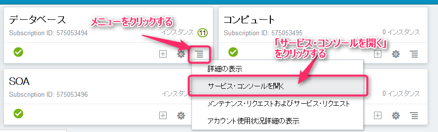
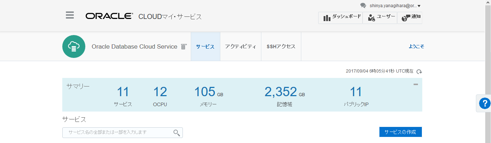
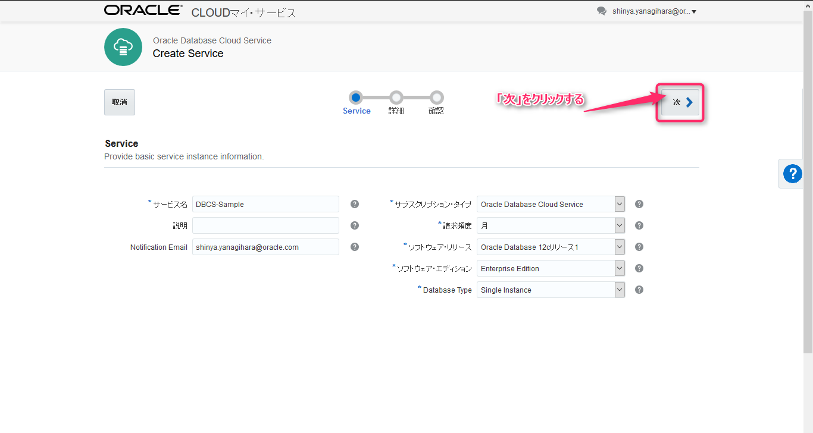
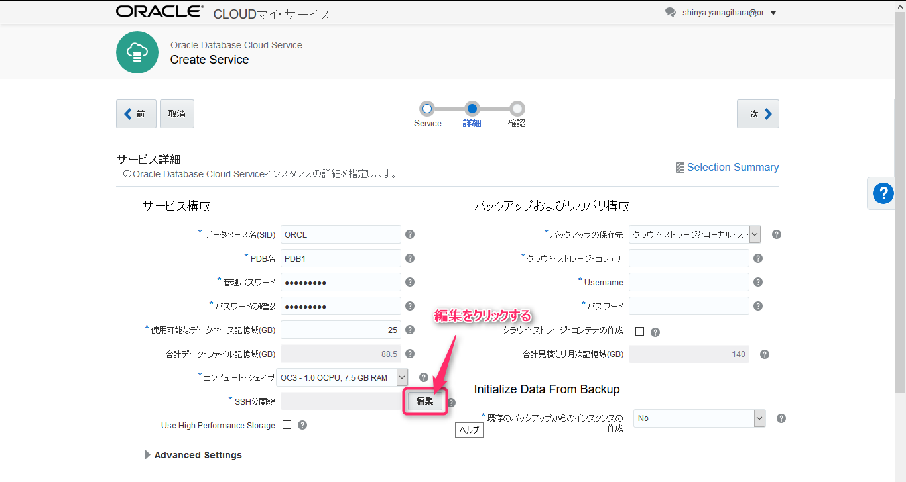
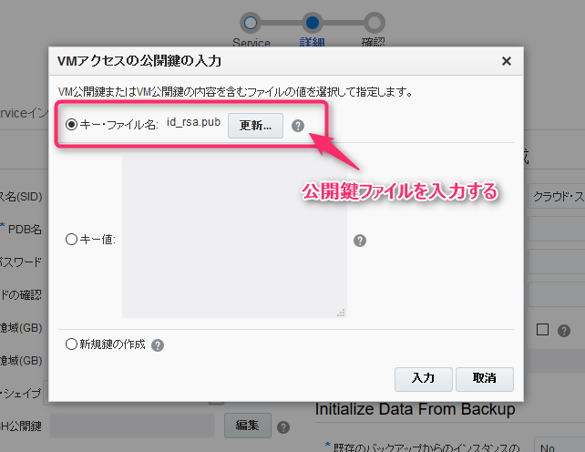
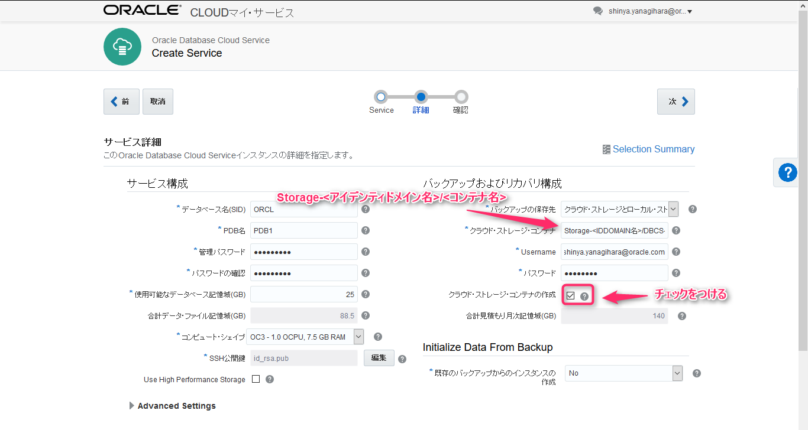
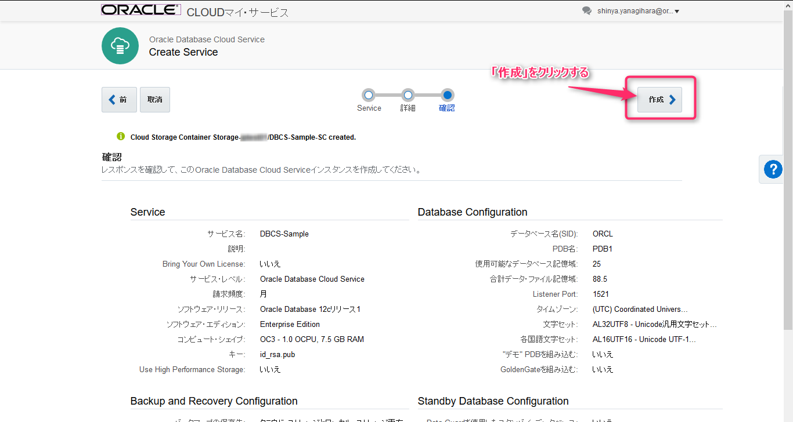

# Oracle Database Cloud Service 環境作成

## 1. Oracle Cloud ダッシュボード画面の表示

Oracle Cloud で利用可能な各種クラウドサービスを一覧表示しています。このダッシュボード画面から、各クラウドサービスのサービスコンソール画面を表示して利用します。

## 2. Oracle Database Cloud Service サービスコンソール画面の表示

カード表示されている各クラウドサービスから、データベースのメニューを選択します。そして、表示される選択肢から「サービス・コンソールを開く」を選択します。

 

## 3. サービスコンソール画面からサービス・インスタンスを作成

Oracle Database Cloud Serice のサービスコンソール画面が表示されます。ここで表示される「サービスの作成」をクリックします。

## 4. サービスインスタンスの情報を入力

|項目|入力値|備考|
|---|------|---|
|サービス名|DBCS-Sample|Database Cloud Service のインスタンス名|
|説明|||
|Notification Emain|自分のメールアドレス|通知宛先用のメールアドレス|
|サブスクリプション・タイプ|Oracle Database Cloud Service|サービスのタイプ|
|請求頻度|月||
|ソフトウェア・リリース|Oracle Database 12c リリース1|以下から選択 11gR1 12cR1 12cR2|
|ソフトウェア・エディション|Enterprise Edition|以下から選択 Standard Edition Enterprie Edition Enterprie Edition - High Performance Enterprie Edition - Extreme Performance|
|Database Type|Single Instance|以下から選択 Single Instance Database Clustering with RAC Single Instance with Data Guard Standby Database Clustering with RAC and Data Guard Standby|

 

## 5. データベースの情報を入力

|項目|入力値|備考|
|---|------|---|
|データベース名(SID)|ORCL||
|PDB名|PDB1||
|管理パスワード|Welcome1#||
|パスワードの確認|Welcome1#||
|使用可能なデータベース記憶域(GB)|25||
|合計データ・ファイル記憶域(GB)|-||
|コンピュート・シェイプ|OC3 - 1.0 OCPU, 7.5 GB RAM||
|SSH公開鍵|下記リンク先にある公開鍵ファイルを使用|コンピュートノードにアクセスする際に使用する鍵ペア|

SSH公開鍵フィールドの右側にある「編集」をクリックし、下記ファイルを選択する:

- [公開鍵ファイル](../resources/ssh-key/labkey.pub)

キーファイル名の選択フィールドで、上記ファイルを選択する。又は、キー値に上記ファイル内に記載される文字列を記述する。

|項目|入力値|備考|
|---|------|---|
|バックアップの保存先|クラウド・ストレージとローカル・ストレージ||
|クラウド・ストレージ・コンテナ|Storage-<アイデンティドメインドメイン名>/DBCS-Sample-CS||
|Username|自分のログインID||
|パスワード|自分のログインパスワード||
|クラウド・ストレージ・コンテナの作成|チェック|コンテナが未作成の場合に新規作成する|

以上の内容を入力した後、画面右上部の「次」をクリックします。

## 6. 入力内容の確認及びインスタンスの作成実施

確認画面で入力内容に特に問題がない場合は、「作成」をクリックします。