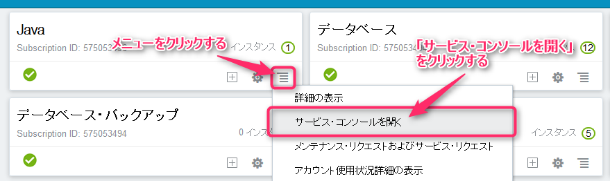
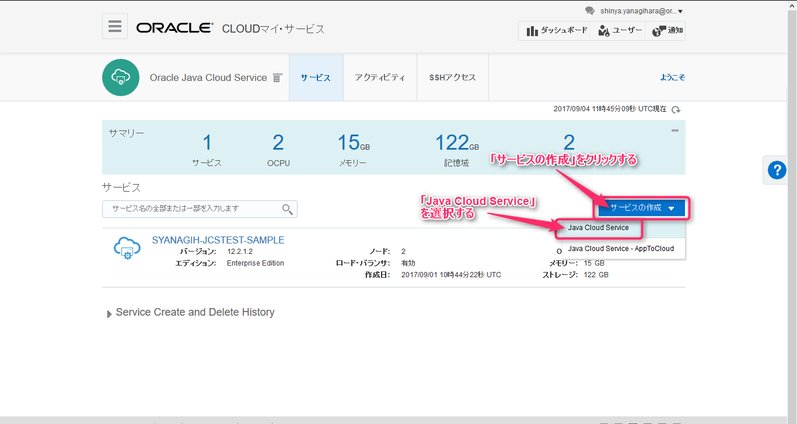
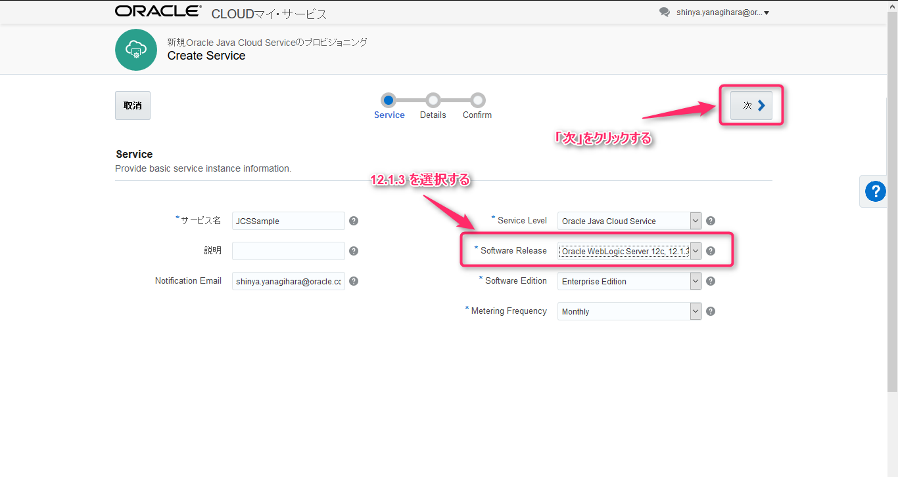
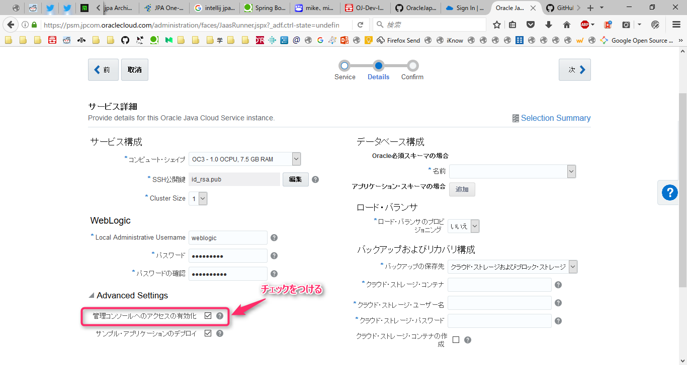
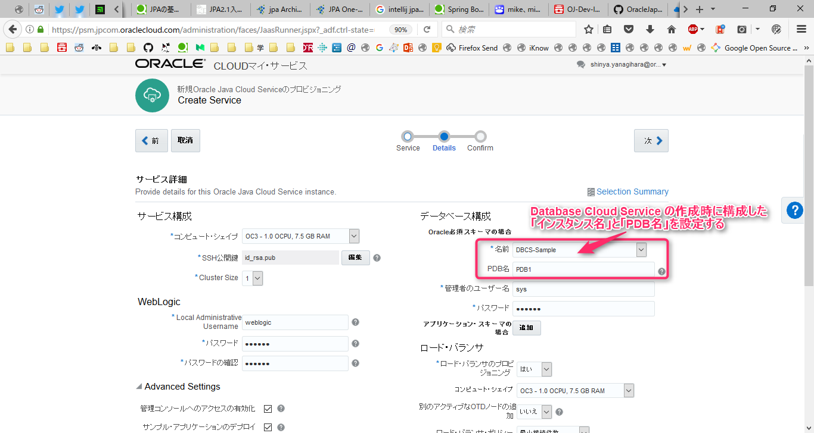
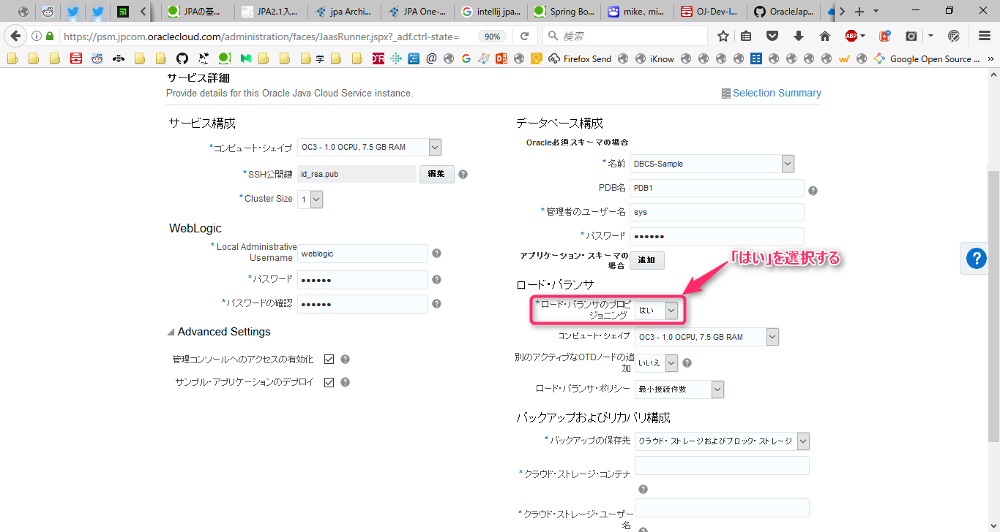
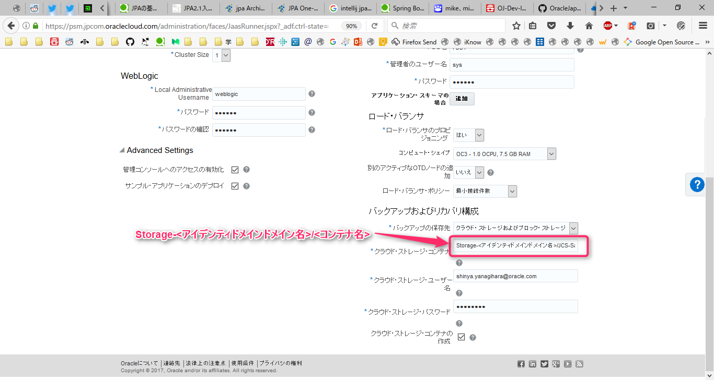
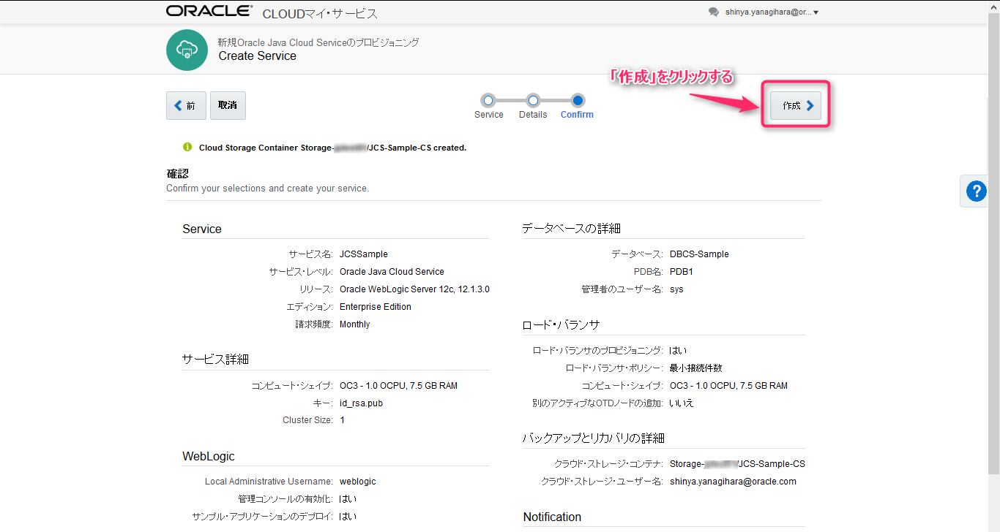

# Oracle Java Cloud Service 環境作成

## 1. Oracle Cloud ダッシュボード画面の表示

Oracle Cloud で利用可能な各種クラウドサービスを一覧表示しています。このダッシュボード画面から、各クラウドサービスのサービスコンソール画面を表示して利用します。

## 2. Oracle Java Cloud Service サービスコンソール画面の表示

カード表示されている各クラウドサービスから、Java のメニューを選択します。そして、表示される選択肢から「サービス・コンソールを開く」を選択します。

## 3. サービスコンソール画面からサービス・インスタンスを作成

Oracle Java Cloud Serice のサービスコンソール画面が表示されます。ここで表示される「サービスの作成」をクリックします。
すると、プルダウンメニューが展開し以下の選択肢が表示されます。

- Java Cloud Service
- Java Cloud Service - AppToCloud

この中から **Java Cloud Service** を選択します。

## 4. サービスインスタンスの情報を入力

|項目|入力値|備考|
|---|------|---|
|サービス名|JCSSample|Java Cloud Service のインスタンス名|
|説明|||
|Notification Emain|自分のメールアドレス|通知宛先用のメールアドレス|
|Service Level|Oracle Java Cloud Service|サービスのタイプ|
|請求頻度|月||
|Software Release|Oracle WebLogic Server 12c, 12.1.3.0|以下から選択 11g, 11.1.1.7 12c, 12.1.3.0 12c, 12.2.1.2|
|ソフトウェア・エディション|Enterprise Edition|以下から選択 Standard Edition Enterprie Edition Enterprie Edition with Coherence|
|Metering Frequency|Monthly|以下から選択 Hourly Monthly|

## 5. WebLogic Serverの構成情報を入力

### サービス構成

|項目|入力値|備考|
|---|------|---|
|コンピュート・シェイプ|OC3 - 1.0 OCPU, 7.5 GB RAM||
|SSH公開鍵|下記リンク先にある公開鍵ファイルを使用|コンピュートノードにアクセスする際に使用する鍵ペア|
|Cluster Size|1|以下から選択 1 2 4|

SSH公開鍵フィールドの右側にある「編集」をクリックし、下記ファイルを選択する:

- [公開鍵ファイル](../resources/ssh-key/labkey.pub)

キーファイル名の選択フィールドで、上記ファイルを選択する。又は、キー値に上記ファイル内に記載される文字列を記述する。

### WebLogic

|項目|入力値|備考|
|---|------|---|
|Local Administrative Username|weblogic|WebLogic 管理者ユーザID|
|パスワード|Welcome1#|WebLogic 管理者パスワード|
|パスワードの確認|Welcome1#||
|管理コンソールへのアクセスの有効化|チェック|管理コンソールアクセスポート(7002)の有効化|
|サンプル・アプリケーションのデプロイ|チェック||

### データベース構成

|項目|入力値|備考|
|---|------|---|
|名前|DBCS-Sample|Oracle Database Cloud Service 環境作成の手順で作成したDBCSインスタンス名|
|PDB名|PDB1||
|管理者のユーザ名|sys||
|パスワード|Welcome1#||

### ロード・バランサ

|項目|入力値|備考|
|---|------|---|
|ロード・バランサのプロビジョニング|はい||
|コンピュート・シェイプ|OC3 - 1.0 OCPU, 7.5 GB RAM||
|別のアクティブなOTDノードの追加|いいえ||
|ロード・バランサ・ポリシー|最小接続件数||

### バックアップおよびリカバリ構成

|項目|入力値|備考|
|---|------|---|
|バックアップの保存先|クラウド・ストレージおよびブロック・ストレージ||
|クラウド・ストレージ・コンテナ|Storage-<アイデンティドメインドメイン名>/JCS-Sample-CS||
|クラウド・ストレージ・ユーザー名|自分のログインID||
|クラウド・ストレージ・パスワード|自分のログインパスワード||
|クラウド・ストレージ・コンテナの作成|チェック||

以上の内容を入力した後、画面右上部の「次」をクリックします。

## 6. 入力内容の確認及びインスタンスの作成実施

確認画面で入力内容に特に問題がない場合は、「作成」をクリックします。
