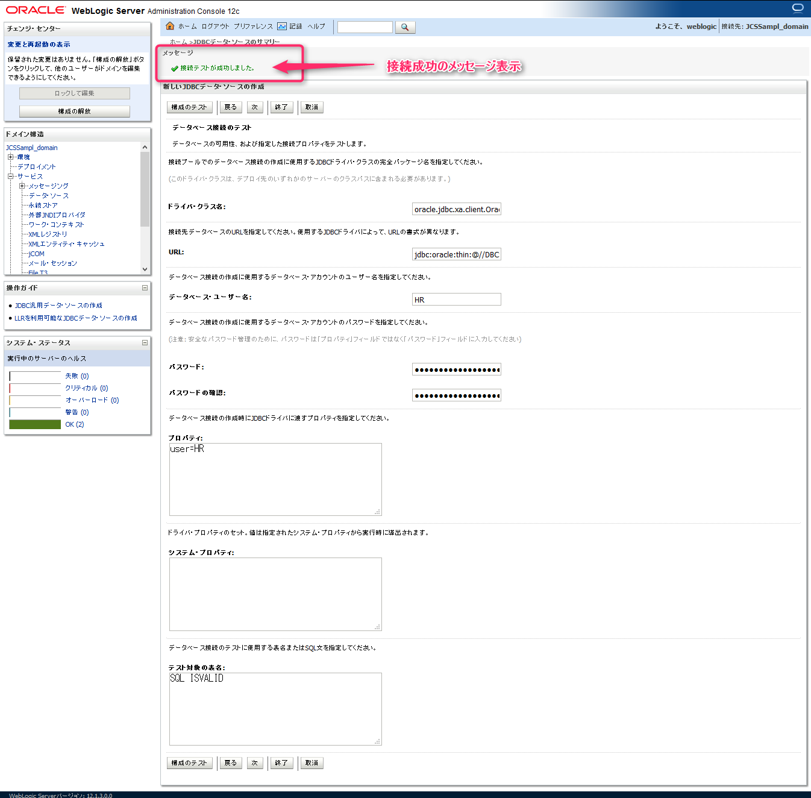
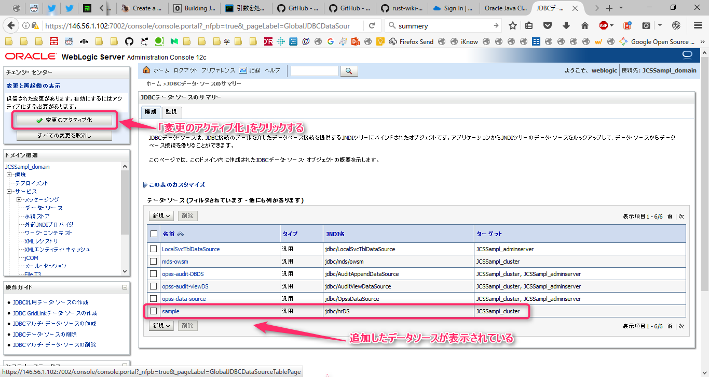
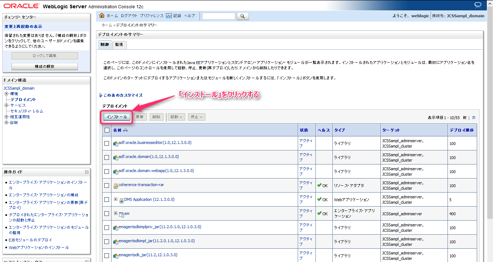
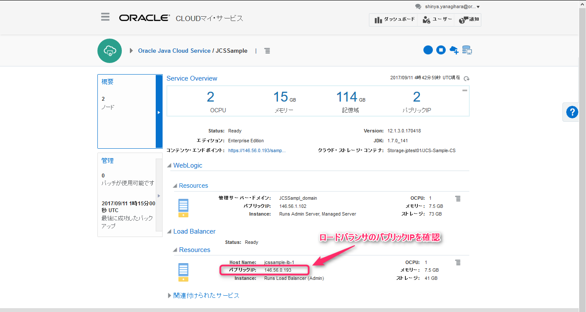

# Java Cloud Service へのアプリケーションのデプロイメント

## 1. Java Cloud Service サービス・コンソールの表示

Java Cloud Service のサービス・コンソール画面を開きます。
アプリケーションをデプロイする対象の Java Cloud Service インタンス名の右側のメニューアイコンをクリックします。
選択肢が複数出てくるので、その中から「WebLogic Server コンソールを開く」を選択します。

## 2. WebLogic Server 管理コンソールへのログイン

WebLogic Server 管理コンソール画面が表示されますので、管理者ユーザIDとパスワード入力してログインします。ここの管理者ユーザは、Java Cloud Service インスタンスの作成時に設定した管理者ユーザIDとパスワードになります。

|設定項目|設定値|
|-------|------|
|ユーザ名|weblogic|
|パスワード|Welcome1#|

## 3. WebLogic Server 管理コンソールの表示

WebLogic Server 管理コンソールが表示されます。画面左部に「ドメイン構造」が表示されています。ここから各種の設定を行います。

まず、Database Cloud Service に作成した データベースに対する接続定義を行います。

## 4. データベースへの接続定義メニューの選択

「ドメイン構造」の中にある選択肢から「サービス」の配下にある「データ・ソース」を選択します。

JDBCデータ・ソースのサマリー画面が表示されると、作成済みのデータ・ソース定義が表示されます。これらは、WebLogicのエンドポイント情報やシステムやアプリケーション固有のポリシー設定、また証明資格などが格納されるために使用する接続定義です。

また、WebLogic Server では構成定義を行う場合は競合が発生しないように排他的にロックをかけてから作業を行うようになっています。画面左上部の「ロックして編集」をクリックします。

## 5. 作成するデータ・ソース種別の選択

「新規」をクリックします。すると複数のデータ・ソース種別が表示されます。その中から **「汎用データ・ソース」** を選択します。

|データ・ソース種別|説明|
|----------------|----|
|**汎用データ・ソース** ※これを選択する|一般的なデータ・ソース|
|GridLinkデータ・ソース|Oracle RACインスタンスで状態の変化に順応して応答するイベント・ベースのデータ・ソース|
|マルチデータ・ソース|汎用データ・ソースをグループ化して抽象的にするデータ・ソース|

## 6. データ・ソース名を設定

各テキストフィールドに以下のように入力します。

|項目名|入力値|説明|
|------|-----|----|
|名前|sample|管理用につける名前 重複しなければ何でもよい|
|JNDI名|jdbc/hrDS|プログラムのソースコードの中で指定する名前 間違えないように入力する事|

上記を入力した後、「次」をクリックします。

## 7. データベース・ドライバの選択

**「データベース・ドライバのタイプ」** の選択肢では、**Oracle's Driver (Thin XA) for Service connections; Varsions:Any** を選択します。

選択後、「次」をクリックします。

## 8.トランザクション・オプション

「次」をクリックします。

## 9. 接続プロパティの設定

|項目名|設定値|
|-----|------|
|データベース名|PDB1.<アイデンティドメイン名>.oraclecloud.internal|
|ホスト名|DBCS-Sample|
|ポート|1521|
|データベース・ユーザー名|HR|
|パスワード|Welcome1#|
|パスワードの確認|Welcome1#|

入力後、「次」をクリックします。

## 10. 接続情報の確認

ここまでの手順により、URLの項目値は以下のように設定されています。

|項目名|設定値|
|-----|------|
|URL|jdbc:oracle:thin:@//DBCS-Sample:1521/PDB1.<アイデンティドメイン名>.oraclecloud.internal|

「構成のテスト」をクリックします。接続情報に間違いがないと下記のようにデータベースへの接続が成功したメッセージが表示されます。

接続の成功が確認できたら、「次」をクリックします。

## 11. ターゲットの選択

定義したデータ・ソースをどのWebLogic Server インスタンスに関連付けるかの設定を行います。

ここでは、**「クラスタのすべてのサーバー」** を選択します。

選択したら **「終了」** をクリックします。

## 12. 構成変更の反映

データ・ソースの一覧表示画面に、作成したデータ・ソース **「sample」** が表示されている事が確認できます。

このデータ・ソースを WebLogic ドメインに反映するために画面左上部の **変更のアクティブ化** をクリックします。

## 13. アプリケーションのデプロイメント

アプリケーションをデプロイするために改めて WebLogic 環境のロックを取得します。画面左上部の **「ロックして編集」** をクリックします。

続いて、ドメイン構造のメニュー内にある **「デプロイメント」** をクリックします。

続いて、**「インストール」** をクリックします。

## 14. デプロイするアプリケーション・ファイルの選択

ローカルPC上にあるアプリケーションをアップロードする場合は、画面文章内にある **「ファイルをアップロード」** をクリックします。

デプロイメント・アーカイブの項目にある **「
参照...」** をクリックします。

documents ディレクトリ配下にある resources/app ディレクトリにアプリケーション **HR.ear** を配置しています。これを選択します。

- [HR.ear](../resources/app/HR.ear)

「参照...」ボタン横に HR.ear が表示されている事を確認したら、「次」をクリックします。

正常にアプリケーションファイルがアップロード出来ている事が確認できたら、「次」をクリックします。

## 15. アプリケーションのインストール

**「このデプロイメントをアプリケーションとしてインストールする」** を選択して 「次」をクリックします。

## 16. デプロイ・ターゲットの選択

アプリケーションのデプロイ先を選択します。
ここでは、**「クラスタのすべてのサーバー」** を選択します。

選択した後、「次」をクリックします。

その後のオプション設定の画面は変更は必要ありません。

そのまま「次」をクリックします。

## 17. アプリケーション・デプロイメントの反映

「終了」をクリックします。

「保存」をクリックします。

## 18. アプリケーションの始動

「デプロイメント」を改めてクリックし、アプリケーションの一覧画面を表示します。そして、「次」をクリックし、デプロイしたアプリケーション（HR）を探します。

インストール直後は、状態が **「準備完了」** となっていて、まだ始動していないので開始する必要があります。

HR横のチェックボックスをクリックした後、**「起動」** ボタンをクリックし **「すべてのリクエストを処理」** を選択します。

「はい」をクリックして、アプリケーションを始動します。

## 19. アプリケーションへのアクセス確認

Java Cloud Service のインスタンス概要画面でロードバランサのパブリック IP を確認します。

確認したロードバランサのIPアドレスを以下のURLに入れて動作確認を行います。

`https://<パブリック IP>/HR-ViewController-context-root/faces/hr.xhtml`

上記のような画面が表示されます。

「Departments」の横にある **「Search」** をクリックします。

departments テーブルに登録されているデータを表示します。

「Employees」の横にある **「Search」** をクリックします。

employeess テーブルに登録されているデータを表示します。

それぞれの正常表示が行えると、アプリケーションの正常デプロイ及び動作、またデータベースへの接続が確認出来ました。
